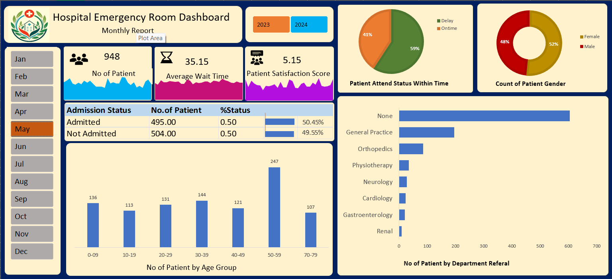

# 🏥 Hospital Emergency Room Analytics Dashboard | Excel
## 📊 Project Overview

The **Hospital Emergency Room Analytics Dashboard** is an interactive Excel dashboard designed to monitor patient flow, emergency room performance, wait times, admission status, referral patterns, and patient demographics.

This dashboard helps hospital administrators and healthcare managers gain actionable insights into emergency room operations, identify bottlenecks, improve patient experience, and support data-driven decision-making.

## 🎯 Business Problem

Emergency rooms often experience high patient volumes, long waiting times, and resource allocation challenges. Healthcare administrators need a centralized reporting solution to monitor operational efficiency and improve patient care.

This dashboard was developed to:

* Monitor patient admissions and attendance.
* Track average patient waiting times.
* Measure patient satisfaction levels.
* Analyze patient demographics.
* Evaluate department referral patterns.
* Support healthcare performance monitoring.

## 🛠️ Tools & Technologies Used

* Microsoft Excel
* Pivot Tables
* Pivot Charts
* Slicers
* Data Cleaning
* Data Visualization
* KPI Reporting

## 📈 Key Performance Indicators (KPIs)

The dashboard provides dynamic KPIs that update based on the selected month and year:

* 👨‍⚕️ Total Patients
* ⏳ Average Wait Time
* ⭐ Patient Satisfaction Score
* 📅 Monthly Performance Monitoring
* 🏥 Patient Admission Analysis
* 🚻 Gender Distribution Analysis
* 🏥 Department Referral Analysis

These metrics help healthcare administrators monitor emergency room performance and operational efficiency across different time periods.

## 📌 Dashboard Features
### 👥 Patient Admission Analysis

Tracks:

* Admitted Patients
* Non-Admitted Patients
* Admission Rate

This helps hospitals understand patient intake patterns and resource requirements.

### ⏱️ Timeliness Analysis

Measures the percentage of patients attended within the target response time.

Benefits:

* Evaluate operational efficiency
* Monitor service quality
* Identify delays in patient care

### 🚻 Gender Analysis

Analyzes patient distribution by gender:

* Male Patients
* Female Patients

Useful for demographic analysis and healthcare planning.

### 🎂 Patient Age Group Analysis

Patient volume is segmented into age groups:

* 0–09
* 10–19
* 20–29
* 30–39
* 40–49
* 50–59
* 70–79

This helps identify age groups requiring the most medical attention.

### 🏥 Department Referral Analysis

Tracks patient referrals to departments such as:

* General Practice
* Orthopedics
* Neurology
* Cardiology
* Physiotherapy
* Gastroenterology
* Renal Care

This assists hospitals in resource allocation and department workload management.

### 📅 Monthly Performance Monitoring

Interactive month slicers allow users to analyze emergency room performance across different periods and identify seasonal trends.

## 📊 Key Insights

* The dashboard enables comparison of admitted versus non-admitted patients.
* Patient attendance within the target response time can be monitored and evaluated.
* Age-group analysis helps identify patient demographics and healthcare demand patterns.
* Department referral analysis highlights areas with higher patient workloads.
* Gender distribution provides additional demographic insights.
* Monthly filtering enables trend analysis and performance monitoring over time.

## 📷 Dashboard Preview

## 💼 Business Value

✔ Healthcare Performance Monitoring

✔ Patient Flow Analysis

✔ Operational Efficiency Tracking

✔ Wait Time Management

✔ Department Workload Analysis

✔ Data-Driven Decision Making

✔ Patient Experience Improvement

## 📂 Repository Contents

Hospital Emergency Room Dashboard.xlsx |
HospitalEmergencyRoomDashboard.png |
README.md

## 🔮 Future Enhancements

* Predictive Patient Volume Forecasting
* Real-Time Emergency Room Monitoring
* Doctor Performance Analytics
* Bed Occupancy Dashboard
* Resource Utilization Analysis
* Power BI Version of Dashboard

## 👨‍💻 Author

Sai Kumar

