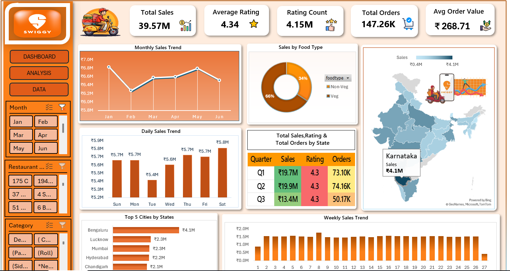

# 🍔 Swiggy Sales Analysis Dashboard (Microsoft Excel)

## 📌 Project Overview

The **Swiggy Sales Analysis Dashboard** is an interactive business analytics project developed entirely in **Microsoft Excel**. This dashboard converts raw sales data into meaningful business insights using Excel's advanced features such as Pivot Tables, Pivot Charts, Slicers, Map Charts, and Conditional Formatting.

The dashboard helps analyze sales performance, customer ratings, order trends, food category distribution, city-wise and state-wise sales, enabling businesses to make informed, data-driven decisions.


## 📸 Dashboard Preview

### Dashboard
# 📸 Dashboard Preview

<p align="center">
  
</p>

## 🎯 Problem Statement

The goal of this project is to analyze Swiggy sales data and answer key business questions, including:

- How do sales fluctuate month by month?
- Which day of the week generates the highest sales?
- What is the revenue contribution of Veg and Non-Veg food?
- Which states generate the highest sales?
- How do quarterly sales, ratings, and orders compare?
- Which cities contribute the highest revenue?
- How do weekly sales trends change over time?

# 📊 Key Performance Indicators (KPIs)

| KPI | Value |
|------|-------|
| 💰 Total Sales | ₹39.57 Million |
| ⭐ Average Rating | 4.34 |
| 📝 Rating Count | 4.15 Million |
| 🛒 Total Orders | 147.26K |
| 💵 Average Order Value | ₹268.71 |


# 📈 Dashboard Features

### 📅 Monthly Sales Trend
- Displays monthly sales performance.
- Helps identify seasonal growth and declining periods.

### 📆 Daily Sales Trend
- Shows sales variation across different days of the week.
- Identifies the busiest ordering days.

### 🍕 Sales by Food Type
- Compares revenue generated by:
  - Veg
  - Non-Veg

### 🗺️ State-wise Sales Analysis
- Interactive Map Chart displaying sales across Indian states.
- Highlights top-performing states.

### 📊 Quarterly Performance Summary
Displays quarterly analysis including:

- Total Sales
- Average Rating
- Total Orders

### 🏙️ Top Cities by Sales
Ranks the highest revenue-generating cities.

### 📈 Weekly Sales Trend
Tracks weekly sales fluctuations to identify consistency and peak business periods.

### 🎛️ Interactive Filters (Slicers)

Users can dynamically filter the dashboard using:

- Month
- Restaurant
- Food Category

# 📂 Dataset Information

The dataset contains various business attributes, including:

- Order ID
- Restaurant Name
- Food Category
- Food Type (Veg / Non-Veg)
- Sales Amount
- Orders
- Ratings
- City
- State
- Date
- Month
- Quarter

# 💡 Business Insights

- Total sales reached **₹39.57 Million**.
- Non-Veg food contributes a larger share of total revenue than Veg food.
- Karnataka generated the highest revenue among all states.
- Saturday recorded the highest daily sales.
- Bengaluru is the top-performing city based on sales.
- Customer satisfaction remained consistently high with an average rating of **4.34**.
- Weekly sales remained relatively stable with minor fluctuations.

# 🛠️ Tools & Technologies Used

- Microsoft Excel
- Pivot Tables
- Pivot Charts
- Slicers
- Excel Map Chart
- Conditional Formatting
- Formulas & Functions
- Dashboard Design
- Data Cleaning
- Data Visualization

# 📊 Dashboard Workflow

```text
Raw Dataset
      │
      ▼
Data Cleaning
      │
      ▼
Data Preparation
      │
      ▼
Pivot Tables
      │
      ▼
Pivot Charts
      │
      ▼
KPI Calculations
      │
      ▼
Interactive Slicers
      │
      ▼
Final Excel Dashboard
```


# 🚀 Skills Demonstrated

- Microsoft Excel
- Data Cleaning
- Data Analysis
- Dashboard Design
- Business Analytics
- Data Visualization
- KPI Reporting
- Pivot Tables
- Pivot Charts
- Slicers
- Map Charts
- Interactive Reporting


# 📚 Learning Outcomes

Through this project, I gained hands-on experience in:

- Cleaning and organizing raw business data.
- Creating interactive dashboards in Microsoft Excel.
- Designing business KPIs for performance tracking.
- Building Pivot Tables and Pivot Charts.
- Using Slicers for dynamic dashboard interaction.
- Creating geographical visualizations using Map Charts.
- Converting raw data into meaningful business insights.
- Presenting analytical findings through professional dashboard design.


# 📈 Business Recommendations

Based on the analysis, the following recommendations can help improve business performance:

- Increase promotional campaigns during low-performing months.
- Focus marketing efforts on high-performing cities and states.
- Expand popular Non-Veg menu offerings while promoting Veg categories.
- Improve customer engagement to maintain high ratings.
- Identify underperforming regions and develop targeted sales strategies.
- Monitor weekly sales trends to optimize staffing and inventory planning.

# ⭐ Project Highlights

✔ Interactive Excel Dashboard

✔ Dynamic Slicers

✔ KPI Cards

✔ Monthly & Daily Sales Analysis

✔ State-wise Sales Map

✔ Quarterly Performance Summary

✔ Weekly Sales Trend

✔ Top Cities Analysis

✔ Business Insights & Recommendations


# 👨‍💻 Author

**Sai Kumar**

🎓 B.Tech – Computer Science & Engineering

📊 Aspiring Data Analyst

### Skills

- Microsoft Excel
- SQL
- Power BI
- Python
- Java


## ⭐ If you found this project useful, please consider giving this repository a **Star**!

Your support is appreciated and motivates me to build more data analytics projects.
