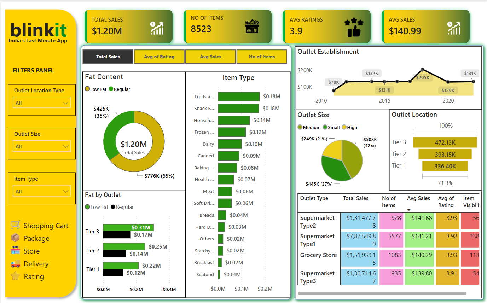

# 🛒 Blinkit Sales Analysis Dashboard

An interactive **Power BI Dashboard** developed to analyze Blinkit's sales performance, customer satisfaction, and inventory distribution. This dashboard provides valuable business insights through dynamic visualizations and key performance indicators (KPIs), helping stakeholders make data-driven decisions.

## 📌 Project Overview

The Blinkit Sales Analysis Dashboard is designed to analyze retail sales data and present meaningful insights using Microsoft Power BI. It enables users to monitor sales performance, compare outlet efficiency, evaluate customer ratings, and identify top-performing product categories through interactive dashboards and filters.

## 🎯 Business Objectives

- Analyze overall sales performance across Blinkit outlets.
- Evaluate customer satisfaction using average ratings.
- Compare sales across different outlet sizes and locations.
- Identify top-performing product categories.
- Analyze the impact of fat content on product sales.
- Track outlet establishment trends over the years.
- Support business decision-making using interactive dashboards.

# 📊 Key Performance Indicators (KPIs)

| KPI | Value |
|------|------|
| 💰 Total Sales | Overall revenue generated from all products sold |
| 📦 Number of Items | Total number of products sold |
| ⭐ Average Rating | Average customer rating |
| 💵 Average Sales | Average revenue generated per transaction |

---

# 📈 Dashboard Features

### 📌 KPI Cards
- Total Sales
- Number of Items
- Average Rating
- Average Sales

### 📊 Sales Analysis
- Total Sales by Fat Content
- Total Sales by Item Type
- Fat Content by Outlet
- Outlet Establishment Trend

### 🏪 Outlet Analysis
- Sales by Outlet Size
- Sales by Outlet Location
- Outlet Type Performance

### 🎛 Interactive Filters
- Outlet Location Type
- Outlet Size
- Item Type

# 📷 Dashboard Preview

# 📌 Key Insights

- Tier 3 outlets generated the highest sales among all outlet locations.
- Regular fat products contributed more revenue than low-fat products.
- Fruits, Snacks, and Household items were the top-selling product categories.
- Medium-sized outlets generated the highest percentage of sales.
- Supermarket Type 1 recorded the highest sales performance.
- Average customer ratings remained consistent across all outlet types.

# 🛠 Tools & Technologies

- Microsoft Power BI
- Power Query
- DAX (Data Analysis Expressions)
- Data Modeling
- Data Cleaning
- Data Transformation
- Data Visualization

# 📊 Dashboard Components

- KPI Cards
- Donut Charts
- Clustered Bar Charts
- Line Chart
- Matrix Table
- Interactive Slicers

# 📊 Visualizations Included

- KPI Cards
- Donut Charts
- Bar Charts
- Line Chart
- Matrix Table
- Interactive Slicers
- Outlet Analysis
- Sales Analysis
- Product Analysis

# 💡 Business Value

This dashboard helps businesses:

- Monitor sales performance.
- Identify top-selling products.
- Compare outlet performance.
- Understand customer preferences.
- Optimize inventory management.
- Support data-driven business decisions.

# 📚 Skills Demonstrated

- Data Cleaning
- Data Transformation
- Data Modeling
- DAX Measures
- Power Query
- Data Visualization
- Business Intelligence
- Dashboard Design
- Analytical Thinking

# 🎯 Future Enhancements

- Forecast future sales using predictive analytics.
- Add customer segmentation analysis.
- Integrate real-time data refresh.
- Develop mobile-friendly dashboard layouts.
- Enhance dashboard with drill-through reports.

# 👨‍💻 Author

**Sai Kumar**

🎓 Computer Science & Engineering Student

## ⭐ If you found this project helpful, don't forget to Star ⭐ this repository!
