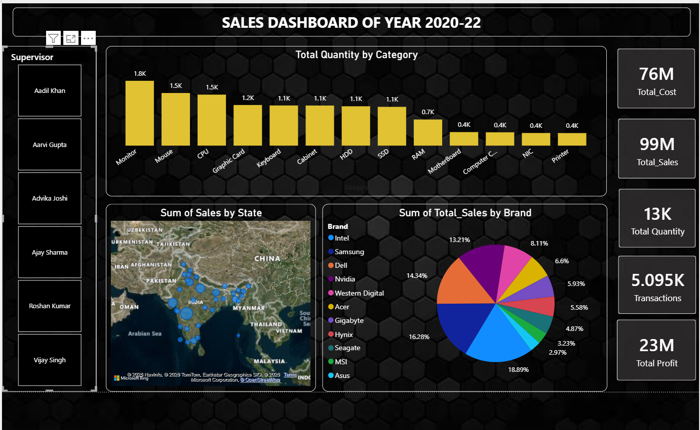

# 🖥️ Computer Hardware Sales Analytics Dashboard | Power BI

## 📊 Project Overview

The **Computer Hardware Sales Analytics Dashboard** is an interactive Power BI project developed to analyze sales performance, profitability, product demand, brand contribution, and regional sales trends across India.

This dashboard provides business stakeholders with a centralized view of key performance indicators (KPIs), helping them monitor business performance, identify top-performing products and brands, and make data-driven decisions.

## 🎯 Project Objectives

* Analyze overall sales performance and profitability.
* Monitor product demand across different hardware categories.
* Evaluate brand-wise sales contribution.
* Visualize state-wise sales distribution across India.
* Track business KPIs and transaction metrics.
* Support strategic business decisions through interactive reporting.

## 🛠️ Tools & Technologies Used

* Power BI
* Power Query
* DAX (Data Analysis Expressions)
* Data Modeling
* Business Intelligence
* Data Visualization

## 📈 Key Performance Indicators (KPIs)

The dashboard provides a high-level overview of business performance:

* 💰 Total Sales: **99M**
* 💵 Total Cost: **76M**
* 📈 Total Profit: **23M**
* 📦 Total Quantity Sold: **13K**
* 🧾 Total Transactions: **5.095K**

## 📌 Dashboard Features

### 📦 Product Category Analysis

Analyzes sales quantity across multiple hardware categories:

* Monitor
* Mouse
* CPU
* Graphic Card
* Keyboard
* Cabinet
* HDD
* SSD
* RAM
* Motherboard
* Computer Components
* NIC
* Printer

This helps identify the most demanded product categories.

### 🏷️ Brand Performance Analysis

The dashboard compares sales contribution across major hardware brands, including:

* Intel
* Samsung
* Dell
* Nvidia
* Western Digital
* Acer
* Gigabyte
* Hynix
* Seagate
* MSI
* Asus

This enables brand-wise performance evaluation and market analysis.

### 🗺️ Geographic Sales Analysis

An interactive map visual displays sales distribution across different states of India, helping businesses identify high-performing regions and growth opportunities.

### 👨‍💼 Supervisor Performance Analysis

Interactive supervisor filters allow users to analyze sales performance by individual supervisors and compare operational results.

## 📊 Key Insights

* Monitor products generated the highest sales quantity among all product categories.
* Intel emerged as the leading contributor to overall sales performance.
* The business generated approximately **23M profit** from **99M total sales revenue**.
* Product categories such as Mouse, CPU, Graphic Cards, HDDs, and SSDs demonstrated strong market demand.
* Sales were distributed across multiple Indian states, indicating broad market coverage and customer reach.
* Interactive visualizations help stakeholders quickly identify trends and business opportunities.

---

## 📷 Dashboard Preview

 

---

## 💼 Business Value

✔ Sales Performance Monitoring

✔ Profitability Analysis

✔ Product Demand Tracking

✔ Brand Performance Evaluation

✔ Regional Sales Analysis

✔ Business Intelligence Reporting

✔ Data-Driven Decision Making

